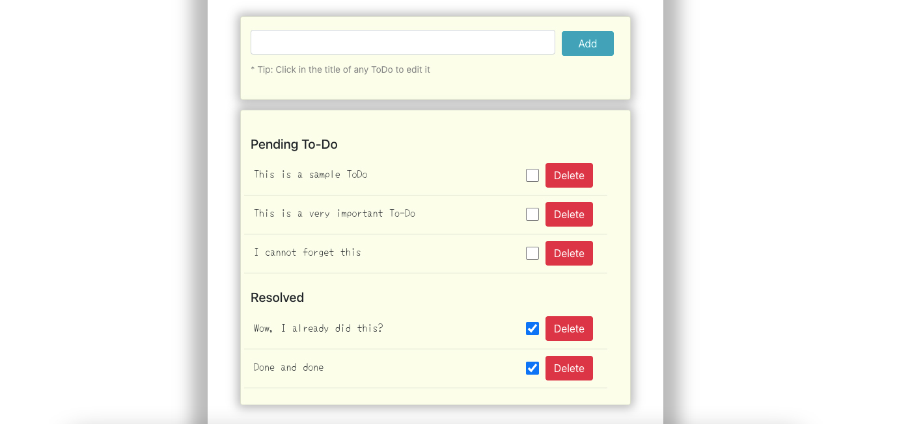

### Simple ToDo List with React - MIT Lab

# Title

Simple ToDo List with React

# Description

This project shows a simple ToDo list where you can add, edit, mark as completed and remove items from your list.

It was created as part of a proposed assignment during the Full Stack Development Professional Certificate career in 2021.

It uses React and Bootstrap as a starting point for styling.

Live Preview: https://renzodupont.github.io/mit-career-2021/week-14/

# How to Run

1 - Clone the repository in your local computer 
2 - Run

### `npm install`

This will get all the needed dependencies in your folder
2 - Finally in the project directory, run:

### `npm start`

Runs the app in the development mode.\
Open [http://localhost:3000](http://localhost:3000) to view it in the browser.

# Future improvements

- Store each ToDos in Cookies so they are not lost on refresh

# Contact info

📫 https://www.linkedin.com/in/renzo-dupont-b9797941/ | https://twitter.com/renzodupont

# License information

MIT Licensed
